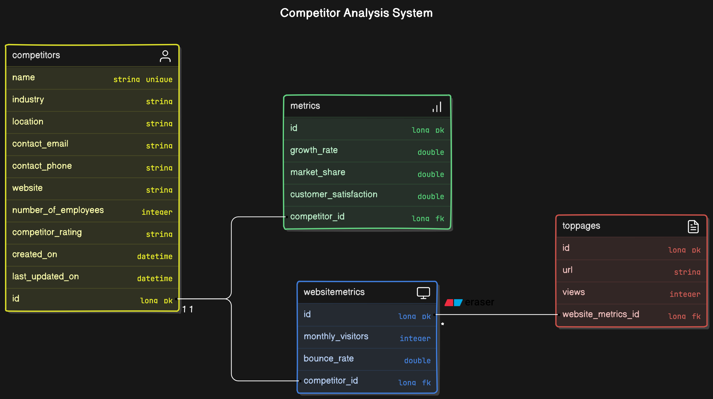

# Backend-test project
Alpha-Next Backend test

# Setting up and testing using docker
1) After cloning the repository, go into the competitor directory by enter *cd competitor* (depending on where you are, you need to navigate to the competitor in your terminal).
2) make sure you have docker on you machine.
3) enter **docker-compose up --build** to build the application.
4) voila! , you can call the endpoints 
5) you can access the swagger documentation here : http://localhost:8080/swagger-ui/index.html
  

# Technologies
1) **Programming Language** : Java 17 (It is fast, scalable and gets the job done faster)
2) **Backend Framework** : SpringBoot 3

# Dependencies
**spring-boot-starter-validation**: Provides support for validating request parameters and payloads using annotations like @NotNull, @NotBlank, @Min, @Max, etc., and handling validation errors.

**spring-boot-starter-actuator**: Enables monitoring and managing your Spring Boot application. It provides production-ready features like health checks, metrics, info endpoints, and more.

**springdoc-openapi-starter-webmvc-ui**: Integrates OpenAPI (formerly Swagger) documentation into your Spring Boot application. It automatically generates and serves API documentation and UI for developers to interact with the API.

**spring-boot-starter-data-jpa**: Simplifies the setup of Spring Data JPA, which provides support for working with relational databases. It includes Hibernate as the JPA implementation and supports automatic repository interfaces.

**spring-boot-starter-web**: Sets up the Spring MVC framework for building web applications. It includes libraries for handling HTTP requests, managing views (with Thymeleaf, FreeMarker, or other templates), and supporting RESTful web services.

**spring-boot-devtools**: Provides development-time features to improve developer productivity. It enables automatic restarts of the application upon classpath changes, configuration changes without restarts, and enhanced debugging support.

**postgresql** : Provides the PostgreSQL JDBC driver necessary to connect your Spring Boot application to a PostgreSQL database at runtime.

**lombok** : Reduces boilerplate code in Java classes by automatically generating getters, setters, constructors, and other common methods using annotations like @Getter, @Setter, @NoArgsConstructor, @AllArgsConstructor, etc.

**spring-boot-starter-test**: Sets up testing frameworks and utilities for testing Spring Boot applications, including JUnit, Mockito, Spring Test, and other testing tools.

# Data dictionary and ERD Diagram

